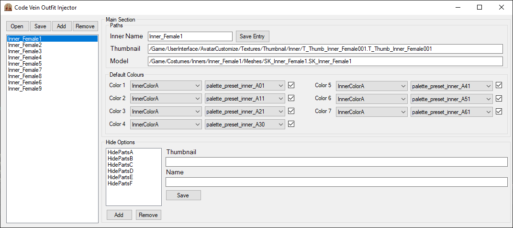

# Work moved to [Project Queen](https://github.com/Code-Vein-Tool-Hub/Project-Queen)
This program will no longer get any updates please use the better rewrite Project Queen instead

# Code Vein Outfit Injector
A simple Gui tool for adding new inner outfits to Code Vein.  

  
  

## Usage

Open the `DT_InnerList_Female.uasset` or `DT_InnerList_Male.uasset` found in CodeVein\Content\Costumes\Inners, the .uexp is required to be in the same folder.  
Use Add Make a new Entry in the list and Remove to delete it, Note: While you can edit the base game outfit the tool will not allow you to remove any of them.

#### The Main Section 
Paths will let you edit things like the Set name, Thumbnail, and what Mesh the outfit uses.  
Default Colours change what colours will be used by default in the character creator.  
All edits in the Main Section will only be updated when you press the "Save Entry" Button

#### Hide Options

Added or Removing Hide Options will automatically update the Outfits Entry, changing the Name or the Thumbnail of the selected hide option will require using the "Save" Button to update the entry.

## Dependencies
- [.NET Framework 4.8](https://dotnet.microsoft.com/download/dotnet-framework)

## Credits
[UAssetAPI](https://github.com/atenfyr/UAssetAPI) by atenfy, Used for phrasing the uasset files
